# DSH Markdown 操作手册

> 产品说明书 · 版本 0.1.0 · 适用平台：macOS（Apple Silicon）
>
> 本手册既是新用户的上手指南，也是产品的完整说明书：从安装启动到每一项功能的使用方法，再到背后的设计思路与技术架构，循序渐进，图文并茂。

---

## 目录

1. [认识 DSH Markdown](#1-认识-dsh-markdown)
2. [快速开始](#2-快速开始)
3. [五分钟上手：写下第一篇笔记](#3-五分钟上手写下第一篇笔记)
4. [五种视图模式](#4-五种视图模式)
5. [编辑器详解](#5-编辑器详解)
6. [双向链接与知识网络](#6-双向链接与知识网络)
7. [图表能力：Mermaid 与思维导图](#7-图表能力mermaid-与思维导图)
8. [AI 助手](#8-ai-助手)
9. [导出 PDF](#9-导出-pdf)
10. [知识库与文件管理](#10-知识库与文件管理)
11. [设置](#11-设置)
12. [快捷键速查](#12-快捷键速查)
13. [架构设计](#13-架构设计)
14. [技术亮点与难点解析](#14-技术亮点与难点解析)
15. [设计流程与取舍](#15-设计流程与取舍)
16. [常见问题 FAQ](#16-常见问题-faq)
17. [附录](#17-附录)

---

## 1. 认识 DSH Markdown

DSH Markdown 是一款**本地优先的智能 Markdown 知识库**桌面应用。它不是一个普通的 Markdown 编辑器，而是一套围绕「笔记之间如何连接」设计的个人知识管理工具：

- **本地优先**：所有笔记以纯 Markdown 文件形式存放在你自己的文件夹里，不锁定、不上云、随时可以用任何其他工具打开。
- **双向链接**：用 `[[笔记名]]` 把笔记连成网络，反向链接、关系图谱一应俱全，灵感不再散落。
- **五种视图**：编辑、分栏、预览、思维导图、知识图谱，一键切换，写、读、梳理各得其所。
- **AI 内建**：接入 DeepSeek（兼容任何 OpenAI 格式端点），可携带当前笔记上下文对话，还能把网页一键整理成笔记。
- **轻快安静**：基于 Tauri 2 + 系统 WebView，内存占用约为 Electron 同类产品的三分之一，M 系列芯片上静音无感。

### 核心价值一句话

> **写得快、连得起来、找得回来、看得明白。**

| 维度 | 说明 |
| --- | --- |
| 写得快 | CodeMirror 6 编辑器 + 自动保存 + 快捷键，心流不被打断 |
| 连得起来 | `[[wikilink]]` 双向链接 + 反向链接面板 + 全库关系图谱 |
| 找得回来 | `⌘P` 快速打开 + 文件名过滤 + 大纲导航 |
| 看得明白 | 实时预览、Mermaid 图表、思维导图、导出 PDF 分享 |

---

## 2. 快速开始

### 2.1 启动应用

双击打开 `DSH Markdown.app`。首次启动会进入欢迎页：

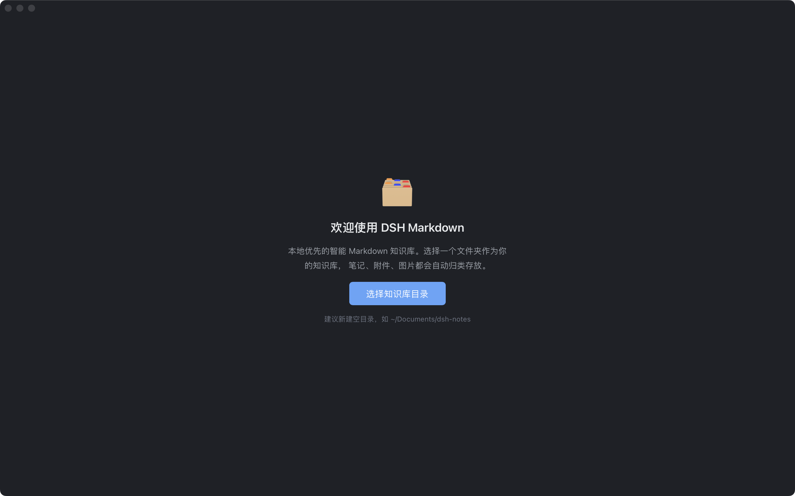

应用不会替你决定笔记放在哪里——点击「**选择知识库目录**」，在弹出的系统对话框中选择一个文件夹（建议新建空目录，如 `~/Documents/dsh-notes`）。这个文件夹就是你的知识库，之后所有笔记、图片附件都会存放在这里。

> 空知识库会自动生成一篇「欢迎使用.md」示例笔记，并预置 `attachments/`（图片附件）、`templates/`（模板）目录。

### 2.2 主界面导览

进入知识库后，主界面分为五个区域：

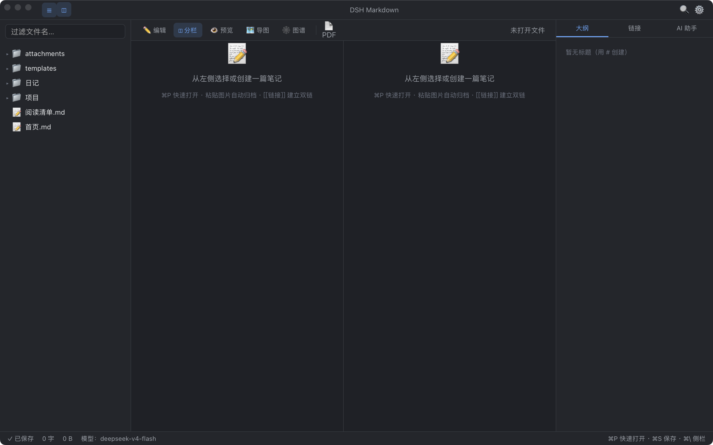

- **① 标题栏**：左侧是侧栏开关（`⌘\`）和右侧面板开关；中间显示当前文件名（未保存时带 `•` 标记）；右侧是快速打开（🔍 `⌘P`）与设置（⚙️）。
- **② 左侧文件树**：知识库的目录结构，支持模糊过滤、右键新建/重命名/删除。
- **③ 中部工具栏与工作区**：五种视图切换（✏️编辑 / ◫分栏 / 👁预览 / 🗺导图 / 🕸图谱）、📄 PDF 导出按钮、当前文件路径；下方是编辑与预览工作区。
- **④ 右侧面板**：大纲 / 链接 / AI 助手 三个标签页。
- **⑤ 状态栏**：保存状态（✓已保存 / ●未保存）、字数统计（中文按字、英文按词）、文件大小、当前 AI 模型与快捷键提示。

---

## 3. 五分钟上手：写下第一篇笔记

**第 1 步：新建笔记。** 在左侧文件树的空白处（或某个文件夹上）点击右键，选择「新建笔记」，输入名称即可。同名文件会自动追加 `-2` 后缀，不会覆盖已有内容。

**第 2 步：开始写作。** 默认的「分栏」模式左边写、右边实时渲染。试试输入：

```markdown
# 我的第一篇笔记

今天开始用 DSH Markdown 记录 [[灵感集]]。

- [x] 学会新建笔记
- [ ] 试试思维导图
```

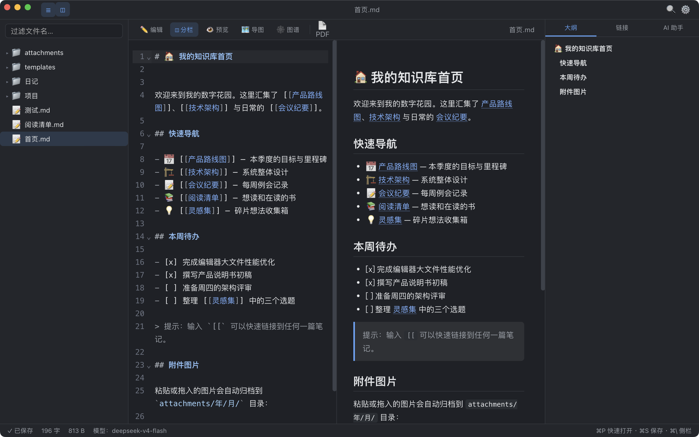

**第 3 步：不用保存。** 停止输入 800ms 后内容会自动落盘，状态栏显示「✓ 已保存」。想立即保存按 `⌘S`。

**第 4 步：建一个链接。** 输入 `[[` 会弹出笔记名自动补全，选择目标即完成双向链接。如果链接的笔记还不存在，在预览里点击它会**自动创建**——这是 Obsidian 式的写作流。

**第 5 步：换个角度看笔记。** 点击工具栏的「🗺 导图」，整篇笔记的标题结构立刻变成一张可缩放的思维导图；点击「🕸 图谱」，整个知识库的链接关系尽收眼底。

到这里，你已经掌握了 80% 的日常用法。接下来逐章深入了解。

---

## 4. 五种视图模式

工具栏左侧的五个按钮对应五种视图模式，适配写作的不同阶段：

### 4.1 ✏️ 编辑模式

纯编辑器视图，专注码字，适合长篇写作或需要最大编辑空间时使用。

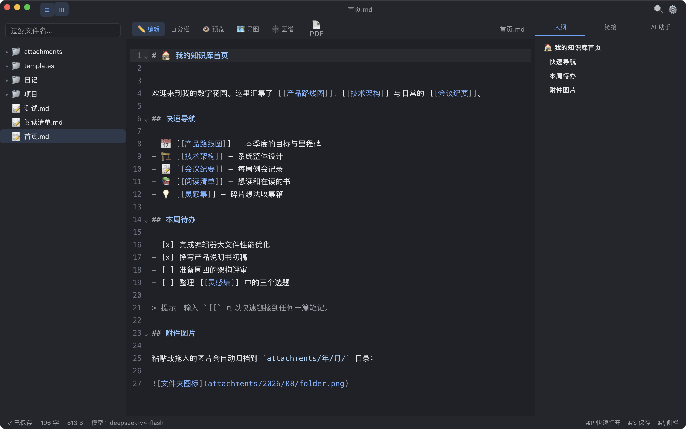

### 4.2 ◫ 分栏模式（默认）

左编辑右预览，实时渲染，是日常写作最常用的模式。

### 4.3 👁 预览模式

纯净的阅读视图，隐藏源码，适合通读校对、演示或导出 PDF 前检查排版。

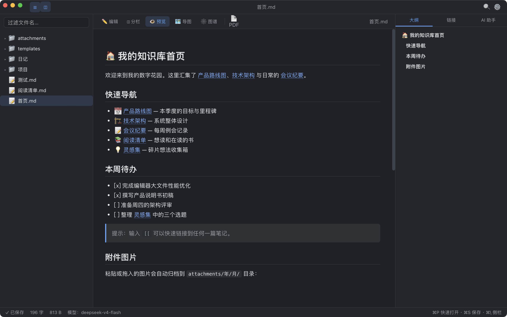

### 4.4 🗺 导图模式

将整篇笔记的标题层级（`#` ~ `####`）自动转换为思维导图，按深度循环着色，默认展开到第三层。适合梳理长文结构、做读书笔记回顾。

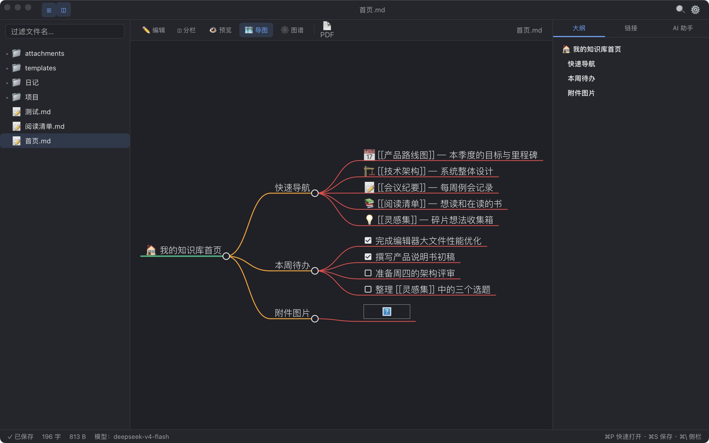

导图支持鼠标拖拽平移、滚轮缩放。代码块内容会被忽略，只保留大纲骨架。

### 4.5 🕸 图谱模式

扫描全库所有 `[[wikilink]]`，绘制笔记之间的关系网络图：

- 每个节点是一篇笔记，连线代表链接关系；
- 力导向物理仿真自动布局，收敛后静止；
- 点击节点直接打开对应笔记。

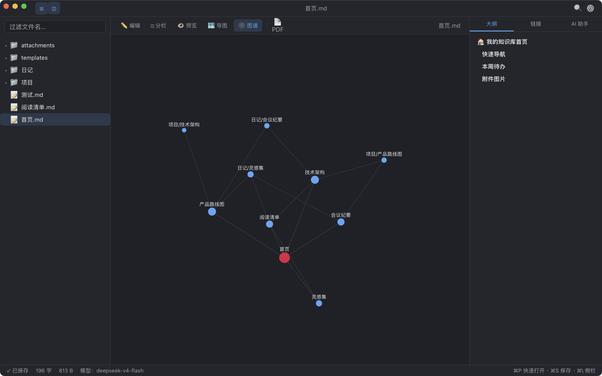

图谱是发现「孤岛笔记」（没有任何链接的笔记）和知识聚簇的利器。

---

## 5. 编辑器详解

### 5.1 编辑体验

编辑器基于 CodeMirror 6，支持 Markdown 语法高亮、搜索替换（`⌘F`）、括号匹配、历史撤销等完整编辑能力。常用格式快捷键：

| 快捷键 | 效果 |
| --- | --- |
| `⌘B` | 选中文字加粗（`**文字**`） |
| `⌘I` | 选中文字斜体（`*文字*`） |
| `⌘K` | 选中文字转为链接 |
| `[[` | 触发笔记名模糊补全 |

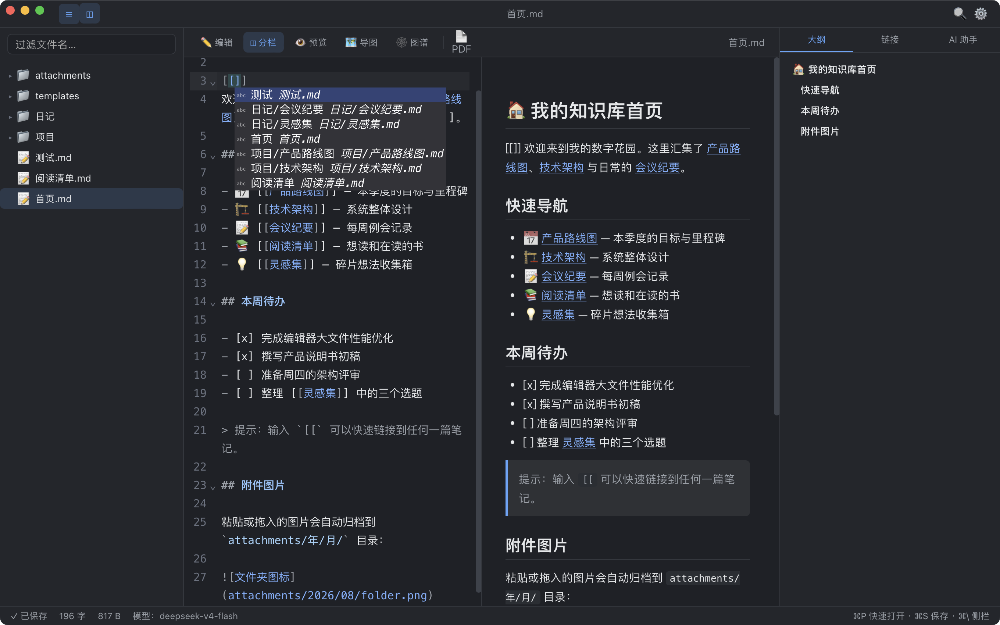

### 5.2 代码高亮

代码块由 Prism 提供高亮，支持 JavaScript / TypeScript / Python / Rust / Bash / JSON / YAML / SQL / TOML / CSS / Go / Java / HTML 等主流语言。语言包按需加载，不拖慢启动。

### 5.3 图片粘贴与归档

直接把截图**粘贴**（`⌘V`）或把图片文件**拖进**编辑器，应用会自动：

1. 将图片保存到 `知识库/attachments/年/月/时间戳-原名`；
2. 在光标处插入相对路径引用，如 ``。

笔记引用相对路径即可正常显示图片，整个知识库文件夹可以随时整体搬迁。

---

## 6. 双向链接与知识网络

这是 DSH Markdown 的灵魂功能。

### 6.1 创建链接

在编辑或预览中，`[[笔记名]]` 即是一个双向链接，支持 `[[笔记名|显示文字]]` 别名语法。编辑时输入 `[[` 触发全库笔记名的模糊补全，回车选中。

### 6.2 跟随链接

在**预览区**点击 wikilink：

- 笔记已存在 → 直接跳转打开；
- 笔记不存在 → **自动创建**并打开，先把想法记下来再说。

### 6.3 反向链接面板

右侧面板切换到「链接」标签，可以看到当前笔记的两个方向：

- **← 引用本笔记**：哪些笔记链接到了这里（反向链接）；
- **→ 本笔记引用**：这篇笔记链接到了哪些笔记。

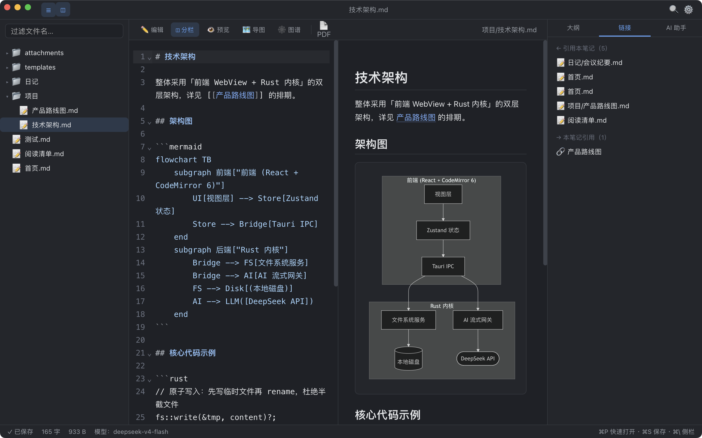

链接索引由 Rust 端并行扫描全库生成，并有 3 秒节流保护，万级笔记也不会卡。

### 6.4 大纲导航

右侧「大纲」标签实时列出当前笔记的标题层级，点击任意标题平滑滚动定位到正文对应位置。

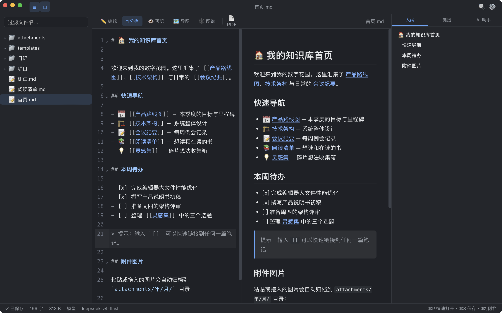

---

## 7. 图表能力：Mermaid 与思维导图

### 7.1 Mermaid 图表

在笔记中用 ` ```mermaid ` 代码块编写 Mermaid 语法，预览区自动渲染为矢量图。流程图、甘特图、时序图、类图、思维导图（`mindmap`）等全部支持：

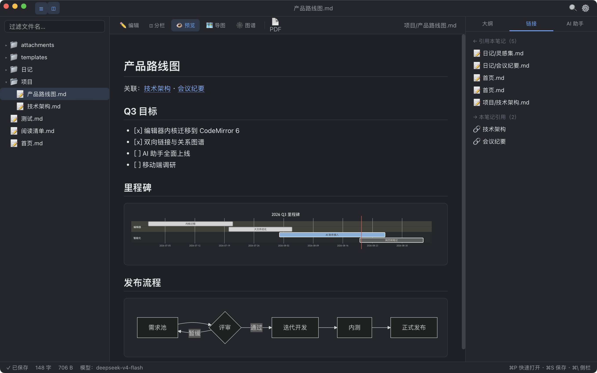

语法写错时会在图表位置显示错误提示，不会弄丢源码。

### 7.2 内嵌思维导图块

除了全文导图（4.4 节），还可以在笔记的任何位置用 ` ```markmap `（或 ` ```mindmap `）代码块内嵌一张局部思维导图：

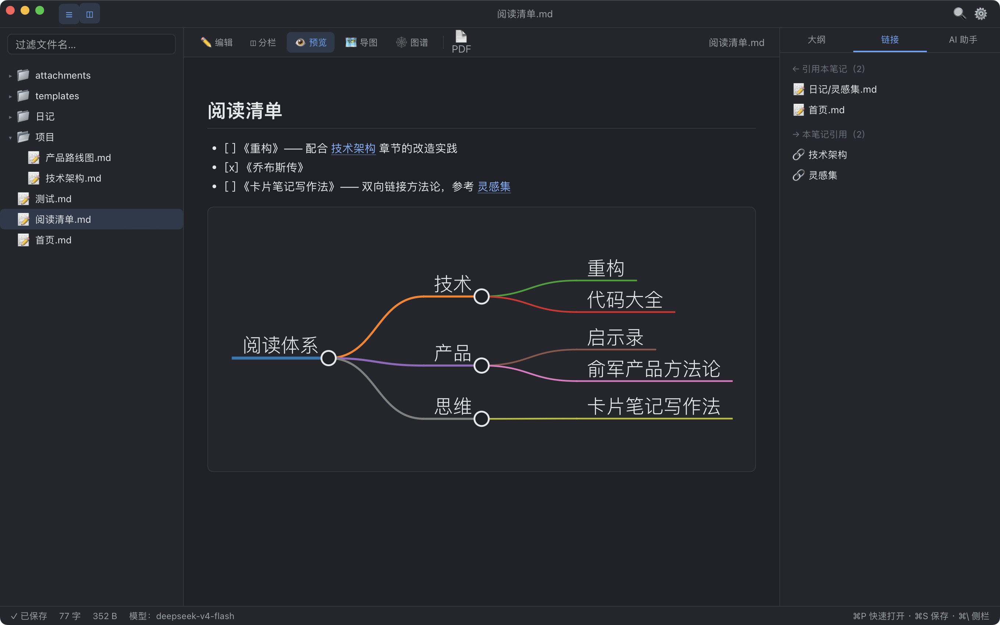

写读书笔记、课程提纲时，文字与导图混排，结构一目了然。

> Mermaid（约 1MB）和 Markmap 渲染库都是**首次用到才动态加载**，平时不占内存。

---

## 8. AI 助手

右侧面板切换到「AI 助手」标签，即可与 DeepSeek 模型流式对话：

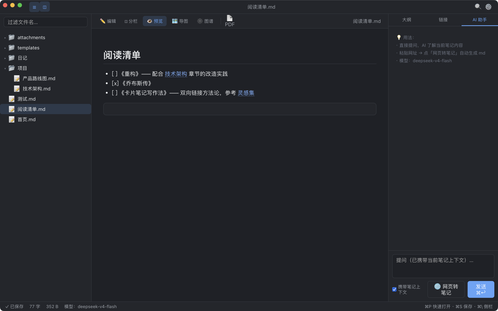

### 8.1 携带上下文提问

默认勾选「携带笔记上下文」：当前打开的笔记（超过 8000 字自动截断）会作为背景资料随问题一起发送。典型用法：

- 「帮我把这篇笔记整理成周报」
- 「这段话有没有更简洁的表达」
- 「根据当前内容补充三个待办」

AI 的回答以 Markdown 渲染，支持流式逐字输出。按 `⌘↩`（或 Ctrl+Enter）发送。

### 8.2 网页转笔记

在输入框粘贴一个 `http(s)://` 链接，「🌐 网页转笔记」按钮变为可用。点击后应用会：

1. 由 Rust 端抓取网页并提取正文（自动剔除广告、导航、脚本）；
2. 交给 AI 整理成结构清晰的中文 Markdown 笔记（标题 + 摘要 + 分节正文）；
3. 生成带 front-matter（标题/来源/剪藏日期）的笔记文件，自动打开。

> 使用前请先在设置中填写 API Key（见 [11. 设置](#11-设置)）。API Key 只保存在本机配置文件中，不会上传。

---

## 9. 导出 PDF

点击工具栏的「📄 PDF」按钮，会调出系统打印对话框，在左下角选择「存储为 PDF」即可导出。

导出走专门的打印样式：代码块和图表自动避免跨页截断、标题后不分页、隐藏侧栏和工具栏，得到干净的分页文档。

---

## 10. 知识库与文件管理

### 10.1 文件树

左侧文件树展示知识库目录，文件夹优先、按名称排序。目录采用**懒加载**——展开时才读取子级，超大知识库也秒开。顶部输入框可按文件名模糊过滤。

### 10.2 右键菜单

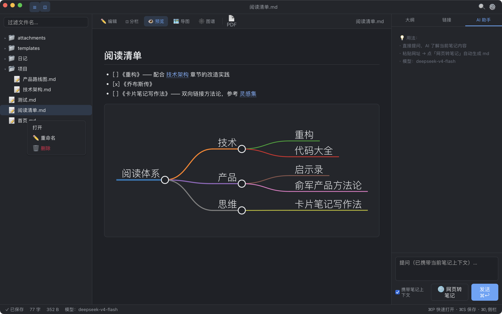

- 文件夹上右键：新建笔记、新建文件夹、重命名、删除；
- 文件上右键：打开、重命名、删除。

**删除不是销毁**：文件会被移入 macOS 系统废纸篓，随时可以反悔找回。新建与重命名时会自动清洗文件名中的非法字符。

### 10.3 外部修改检测

如果你同时在用其他编辑器（比如 VS Code）修改了同一篇笔记，应用会通过系统级文件监听（macOS FSEvents，400ms 去抖）感知变化，在顶部弹出提示条，由你选择「重新加载」或「忽略」——绝不悄悄覆盖你的内容。

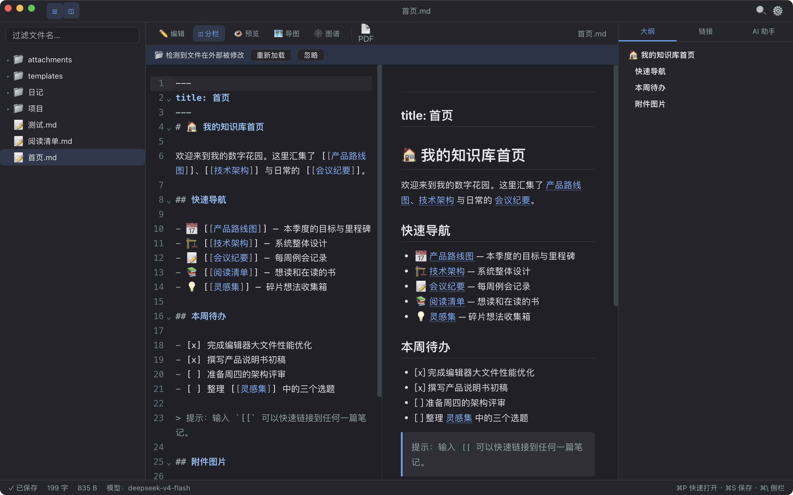

### 10.4 数据安全设计

- **原子写入**：保存时先写入临时文件再原子替换，断电也不会出现半截文件；
- **路径防护**：所有文件操作严格限制在知识库目录内，杜绝路径穿越；
- **废纸篓删除**：删除可恢复。

---

## 11. 设置

点击标题栏右侧 ⚙️ 打开设置：

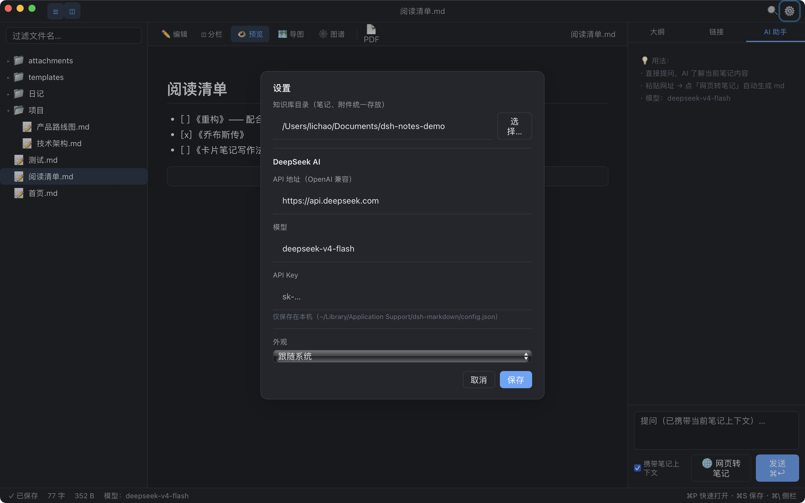

| 设置项 | 说明 |
| --- | --- |
| 知识库目录 | 更换知识库位置（笔记、附件统一存放） |
| API 地址 | 默认 `https://api.deepseek.com`，支持任何 OpenAI 兼容端点（自建网关、其他厂商均可） |
| 模型 | 默认 `deepseek-v4-flash`，可改为你的端点支持的任意模型 |
| API Key | 仅保存在本机 `~/Library/Application Support/dsh-markdown/config.json` |
| 外观 | 浅色 / 深色 / 跟随系统（系统切换时实时响应） |

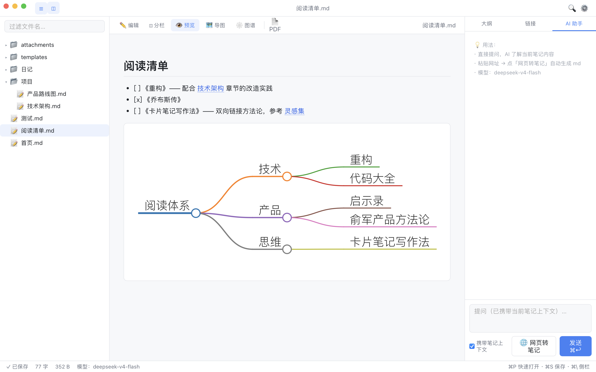

---

## 12. 快捷键速查

| 快捷键 | 功能 |
| --- | --- |
| `⌘P` | 快速打开笔记（模糊搜索，↑↓ 选择，回车打开） |
| `⌘S` | 立即保存（平时 800ms 自动保存） |
| `⌘\` | 显示 / 隐藏侧栏 |
| `⌘B` / `⌘I` / `⌘K` | 粗体 / 斜体 / 链接 |
| `[[` | 笔记名补全 |
| `⌘F` | 编辑器内搜索 |
| `⌘↩` | AI 面板发送 |

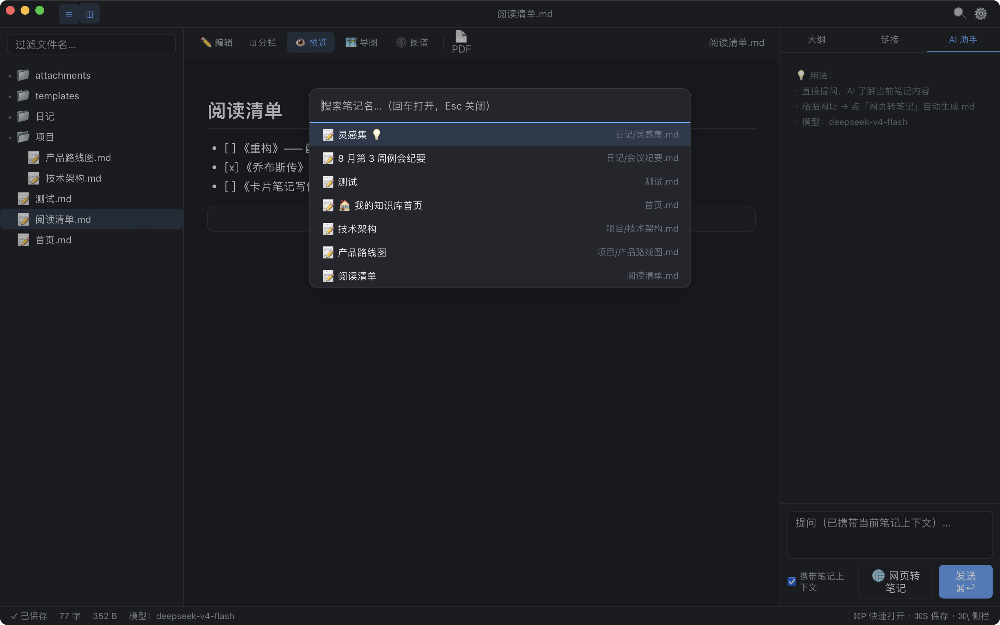

---

## 13. 架构设计

### 13.1 总体架构

DSH Markdown 采用「**Web 前端 + Rust 内核**」的双层架构，前后端通过 Tauri 2 的 IPC 桥通信：

```
┌───────────────────────────────────────────────────────┐
│  前端（React 19 + TypeScript，运行于系统 WKWebView）      │
│  ┌─────────────┬──────────────┬─────────────────────┐ │
│  │ 视图层        │ 状态层        │ 渲染层               │ │
│  │ 11 个组件     │ zustand      │ markdown-it 插件链   │ │
│  │ 文件树/编辑器/ │ 全局 store   │ CodeMirror 6 编辑器  │ │
│  │ 预览/导图/图谱 │ 防抖自动保存  │ mermaid/markmap 懒载 │ │
│  └─────────────┴──────────────┴─────────────────────┘ │
│                        │ Tauri IPC（17 个命令 + 事件）   │
├───────────────────────────────────────────────────────┤
│  Rust 内核（7 个模块）                                  │
│  ┌──────────┬──────────┬──────────┬────────────────┐  │
│  │ fs.rs     │ watcher.rs│ ai.rs    │ fetch.rs       │  │
│  │ 文件读写   │ FSEvents  │ SSE 流式  │ 网页正文提取    │  │
│  │ 原子写入   │ 变更监听   │ AI 网关  │                │  │
│  │ 链接索引   │          │          │                │  │
│  │ (rayon    │          │ (tokio   │                │  │
│  │  并行)     │          │  异步)    │                │  │
│  └──────────┴──────────┴──────────┴────────────────┘  │
└───────────────────────────────────────────────────────┘
         │                        │
   本地知识库文件夹            DeepSeek / OpenAI 兼容 API
```

### 13.2 职责划分

- **前端负责「看与写」**：所有交互、渲染、状态管理。重计算（markdown 渲染、力导向图布局）均在 WebView 内完成，按需加载大件依赖。
- **Rust 负责「文件与网络」**：文件系统操作、目录监听、网页抓取、AI 流式请求——这些涉及系统 API 和长连接的工作交给原生层，前端永远不直接碰磁盘和网络。

### 13.3 关键数据流

**保存链路**：编辑器内容变更 → zustand 更新 → 800ms 防抖 → `write_file` 命令 → Rust 先写 `.md.tmp` 再 rename 原子替换 → watcher 感知变化（去抖 400ms）→ 与内存比对后确认「自己的保存」，不误报外部修改。

**AI 流式链路**：前端发起 `ai_chat` 命令（立即返回 requestId）→ Rust 用 tokio 后台任务请求 SSE 流 → 每个数据块经 `ai-chunk-{requestId}` 事件推送 → 前端 Promise 拼接全文并逐字渲染。

---

## 14. 技术亮点与难点解析

### 14.1 大文件不卡：视口渲染 + 阈值降级

- CodeMirror 6 只做视口增量渲染，10MB 级文档也能流畅编辑；
- 超过 2MB 的文件自动进入「大文件模式」：停用实时预览（预览是全量渲染，大文件下代价高），编辑、保存、导出不受影响；
- 文件树懒加载、链接索引 rayon 并行 + 3 秒节流。

### 14.2 启动快、常驻轻：全链路按需加载

mermaid（约 1MB）、markmap、Prism 及其 14 个语言包、CodeMirror 的代码语言包，全部动态 `import()` 懒加载——用不到的功能不占内存，这也是内存能压到 ~100MB 的关键。

### 14.3 markdown-it 插件链：四条自定义规则

- `[[wikilink]]` inline 规则（正确排除 `![[embed]]` 图片语法）；
- fence 重写：`mermaid`/`markmap` 代码块输出占位符，由 React 异步替换为真实图表；
- `heading_open` 注入 `data-line` 行号，支撑大纲点击精准定位；
- 图片相对路径转 Tauri asset 协议，本地图片安全显示。

### 14.4 无依赖力导向图谱

知识图谱没有用 d3 等重型库，约 150 行自绘 Canvas：斥力 + 引力 + 向心力，带阻尼与 alpha 衰减，收敛后自动降频；适配 Retina 高分屏，支持节点拖拽与点击命中检测。

### 14.5 流式 AI 的桥接模式

Tauri 命令是「请求-响应」模型，不适合流式。本应用采用「命令立即返回 + 事件推流」的桥接：Rust 端 tokio 任务解析 SSE，通过带 requestId 的事件通道推增量，前端封装成一个普通的 async 函数，调用方完全感知不到复杂度。

### 14.6 原子写入与文件监听的配合

保存采用「临时文件 + rename」原子写。但 rename 会触发文件监听事件，容易造成「自己保存 → 误报外部修改」。解法：收到变更事件后先把磁盘内容与内存内容比对，一致则静默；只有确实不一致且用户没有未保存修改时才提示重载。

---

## 15. 设计流程与取舍

本产品的设计遵循「**先跑通核心闭环，再逐层增强**」的路径：

1. **确立北极星**：本地优先 + 双向链接。先回答「笔记放哪」（用户自己的文件夹）和「笔记如何关联」（`[[wikilink]]`）两个问题。
2. **选型权衡**：在 Electron 与 Tauri 之间选择了后者——安装包从 ~200MB 降到 ~4MB（DMG），常驻内存约为三分之一，代价是生态较新，部分能力（如打印样式、asset 协议）需要自己打磨。
3. **核心闭环**：编辑器（CodeMirror 6）→ 实时预览（markdown-it）→ 自动保存（防抖 + 原子写）→ 文件树，先让「写」这件事无可指摘。
4. **网络化**：双链补全、反向链接、全库图谱，把「一堆文件」变成「一张网」。
5. **智能化**：AI 对话与网页转笔记作为增强层，且刻意保持可插拔——任何 OpenAI 兼容端点皆可接入，不绑定单一厂商。
6. **性能收尾**：大文件保护、懒加载、节流去抖，保证知识库长大之后依然轻快。

交互设计上坚持三条原则：

- **渐进呈现**：默认分栏，高级功能（导图、图谱、AI）各居其位，不打扰新手；
- **键盘可达**：高频操作都有快捷键，`⌘P` 一键直达任何笔记；
- **宽容设计**：删除进废纸篓、链接不存在就先创建、图表语法错了给提示而不是崩页面。

---

## 16. 常见问题 FAQ

**Q：笔记存在哪里？换电脑怎么办？**
A：全部在你的知识库文件夹里，纯 Markdown + 图片附件，整体拷贝即可迁移，也可以用 Git、iCloud 同步这个文件夹。

**Q：AI 功能必须联网吗？**
A：是的，AI 对话与网页转笔记需要联网调用 API；其余所有功能完全离线可用。没有填 API Key 不影响编辑、预览、导图、图谱等任何本地功能。

**Q：打开特别大的文件会怎样？**
A：超过 2MB 自动进入大文件模式，停用实时预览保持编辑流畅，状态栏会显示「大文件模式」。

**Q：删除的笔记能找回吗？**
A：能。删除操作移入 macOS 系统废纸篓，从废纸篓恢复即可。

**Q：支持全文搜索吗？**
A：当前版本提供文件名过滤与 `⌘P` 快速打开；全文搜索的后端引擎（并行扫描）已就绪，界面入口将在后续版本开放。

---

## 17. 附录

### 17.1 知识库目录结构

```
知识库/
├── attachments/     # 粘贴/拖入的图片，按 年/月 归档
├── templates/       # 笔记模板（自行放置）
├── .dsh/            # 应用内部数据（勿删）
└── 你的笔记与文件夹…
```

### 17.2 配置文件

`~/Library/Application Support/dsh-markdown/config.json`，包含知识库路径、API 地址、模型、API Key（仅本机）与主题设置。

### 17.3 技术栈与构建

- 前端：React 19 + TypeScript + Vite + zustand + CodeMirror 6 + markdown-it + mermaid + markmap + Prism
- 后端：Rust + Tauri 2（notify / trash / reqwest / tokio / rayon）
- 开发：`npm run tauri dev`；打包：`npm run tauri build`（产物在 `src-tauri/target/release/bundle/`）

---

*手册版本：v1.0 · 对应产品版本 0.1.0 · 最后更新：2026-08*
